# Release schedule proposals

To add a new proposal to this list, update the `schedule` variable in `lib/index.js`,
the SVG name in `bin/lts.js`, and use the following command:

```sh
node ./bin/lts.js >> release-schedule-proposal/README.md
```

## Enterprise Feedback

* Current releases are generally ignored (including the even-numbered releases).
* Prefer to keep (i.e. do not shorten) 30 month LTS support window (from start of Active LTS through to End-of-Life).
* Several teams asked if the LTS support window could be extended (5 years was quoted for other software (e.g. OpenSSL) LTS).
* Want predictable cadence for forward planning.
* Want LTS support window overlap to aid migration from one LTS release line to another.

## Dependency lifecycles

(Non-exhaustive list)

| Dependency | LTS policy | Notes |
|-|-|-|
| c-ares | Unknown | - |
| ICU4C | Unknown | Releases historically appear to be April and October. We have generally updated within release lines as ICU does not consider changes to localized output to be breaking, but we have had issues raised against Node.js when output changes |
| libuv | None | Has historically accommodated Node.js due to overlap of collaborators/maintainers |
| npm   | None | https://github.com/npm/cli/wiki/Integrating-with-node |
| OpenSSL | [Policy](https://openssl-library.org/policies/releasestrat/index.html). New LTS every 2 years. Each LTS supported minimum of 5 years. | "In essence that means an LTS will be released every April in odd-numbered years." so may just miss new LTS versions for Node.js semver-majors if we keep to April releases |
| Undici | Unknown | Overlap of collaborators/maintainers with Node.js |
| V8 | None. Does not follow semver. | V8 updates are generally considered semver-major as the V8 ABI is part of Node.js' |
| zlib | Unknown | Node.js is using Chromium's fork of zlib |

Here are the release schedule proposals:

## Status quo

1. Current duration: 6 months
2. Active duration:
 - For even-numbered releases: 12 months
 - For odd-numbered releases: 0 months
3. Maintenance duration:
 - For even-numbered releases: 18 months
 - For odd-numbered releases: 3 months

Total life span (from start of beta until end of maintenance):

- For even-numbered releases: 36 months
- For odd-numbered releases: 9 months

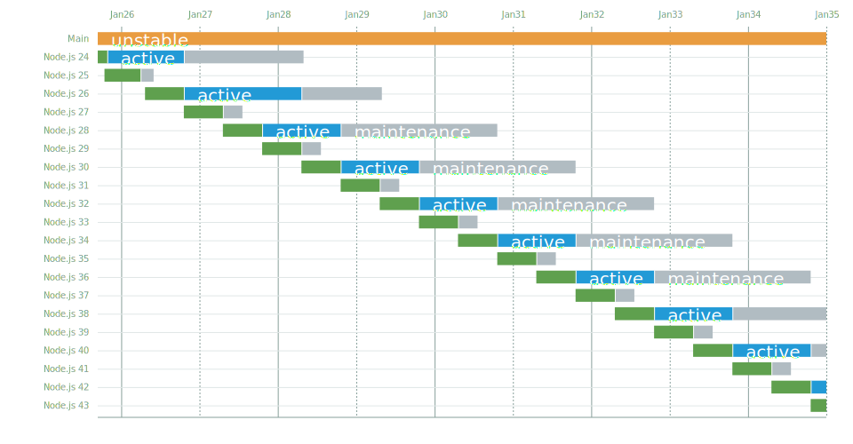

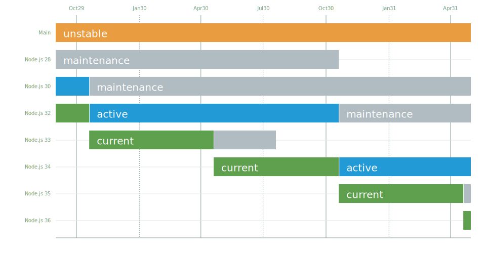

### Maintainers Feedback

* Current release cadence (2 majors/year) is seen as burdensome — too many active branches and backports.
* Reducing to one major per year would **lower the number of active release lines**, easing backporting release management.
* **Security releases** would be simpler to coordinate, with fewer simultaneous branches to patch and less overlap between LTS lines.
* Shorter maintenance windows would **limit the volume of non-security backports**, allowing focus on critical fixes only.
* Concerns remain about ecosystem adaptation, but the **reduction in workload is broadly seen as a clear benefit**.

## Proposal 1: LTS every year

1. Alpha duration: 5 months
2. Beta duration: 1 months
3. Current duration: 6 months
4. Active duration: 12 months
5. Maintenance duration: 18 months

Total life span (from start of beta until end of maintenance): 37 months

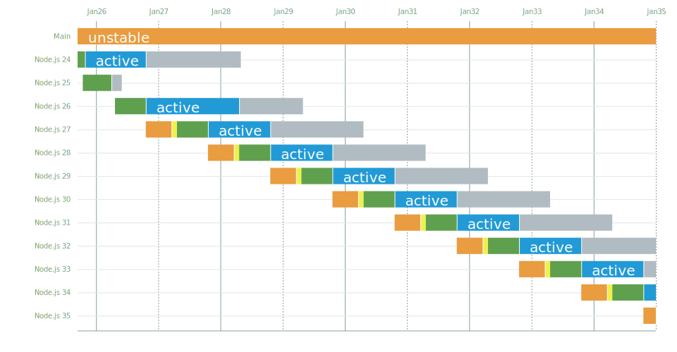

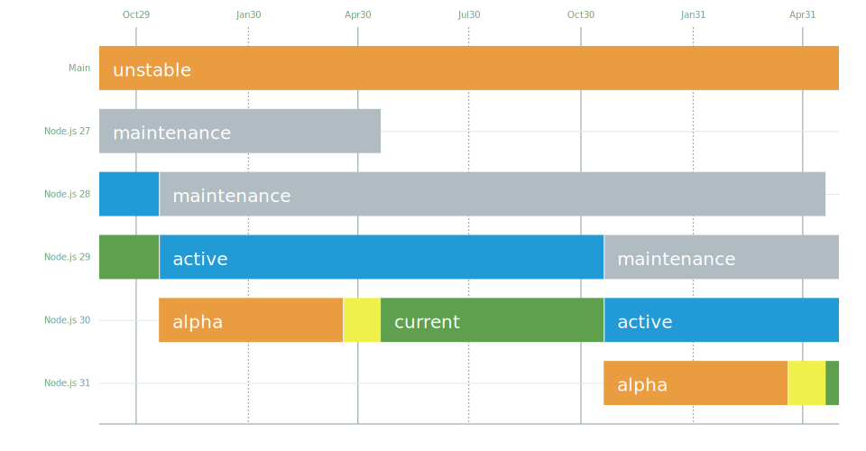

### Alpha and Beta definition

#### Stability expectations

Alpha releases may contain semver-major changes (assuming such change does not "break the ecosystem"),
but no ABI-breaking changes (so native addons can be tested on those versions).

Once the release has reached the beta period, semver-major changes will no
longer be included, except:

- security fixes
- V8 update
- one-time exception granted by the TSC

Once the beta period is ended, only security fixes and one-time exception
granted by the TSC may contain semver-major changes.

Updating V8 during the Beta period is considered the optimal tradeoff, despite
the ABI and API potential breakage, as otherwise the included V8 version would
be 1 year old by the time the release line transitions to LTS.

#### Release frequency

Version | Tentative Date | Type of changes
--------|--------------| -------------
v27.0.0-alpha.0 |  2026-10-20  | Branch-off
v27.0.0-alpha.1 |  2026-11-03  | most changes[^1]
v27.0.0-alpha.2 |  2026-11-17  | most changes[^1]
v27.0.0-alpha.3 |  2026-12-01  | most changes[^1]
v27.0.0-alpha.4 |  2026-12-15  | most changes[^1]
v27.0.0-alpha.5 |  2026-12-29  | most changes[^1]
v27.0.0-alpha.6 |  2027-01-12  | most changes[^1]
v27.0.0-alpha.7 |  2027-01-26  | most changes[^1]
v27.0.0-alpha.8 |  2027-02-09  | most changes[^1]
v27.0.0-alpha.9 |  2027-02-23  | most changes[^1]
v27.0.0-alpha.10 |  2027-03-09  | most changes[^1]
v27.0.0-beta.0 |  2027-03-23  | most changes[^1] + V8 update
v27.0.0-beta.1 |  2027-04-06  | semver-minor only + V8 update
v27.0.0 |  2027-04-20  | semver-minor only
v27.x.x |  2027-05-04  | …
v27.x.x |  2027-10-05  | …
v27.x.x (LTS transition) |  2027-10-20  | no changes
(Maintenance transition) |  2028-10-20  | _No release_ 
(End-of-Life) |  2030-10-20  |  _No release_

[^1]: Most changes from `main`, except those marked as `dont-land-on-v27.x` because e.g. they contain ABI-breaking changes, or are considered too breaking for the ecosystem, or are moving a deprecation to EOL if 27.x already contains the change moving it to Runtime.

#### Security support

TL;DR: TBD

It has not been decided whether security fixes would
trigger a security release, or if those would simply be included in the next
regular release (potentially ahead of schedule). The difference on a maintenance
perspective is that a security release requires locking the CI until all the
queued security releases are ready.

## Proposal 2: Longer life cycle

1. current duration:
 - for even-numbered releases: 6 months
 - for odd-numbered releases: 12 months
2. active duration:
 - for even-numbered releases: 18 months
 - for odd-numbered releases: 0 months
3. maintenance duration:
 - for even-numbered releases: 24 months
 - for odd-numbered releases: 2 months

Total life span (from start of beta until end of maintenance):
- for even-numbered releases: 48 months
- for odd-numbered releases: 14 months

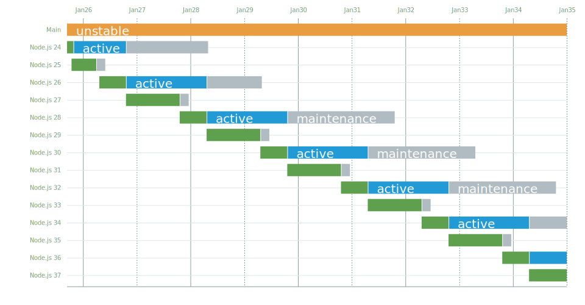

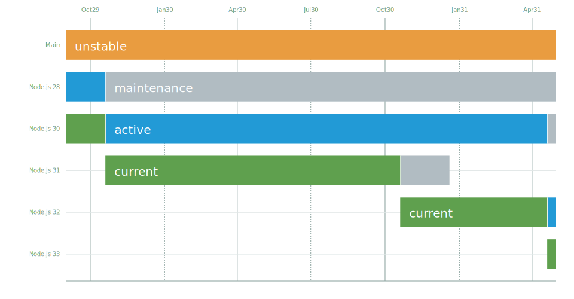

## Proposal 3: Less frequent LTS

1. current duration: 6 months
2. active duration:
 - for modulo-4-numbered releases: 24 months
 - for other releases: 0 months
3. maintenance duration:
 - for modulo-4-numbered releases: 18 months
 - for other releases: 2 months

Total life span (from start of beta until end of maintenance):
- for module-4-numbered releases: 48 months
- for releases: 8 months

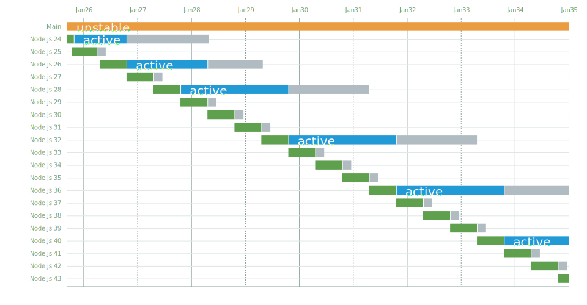

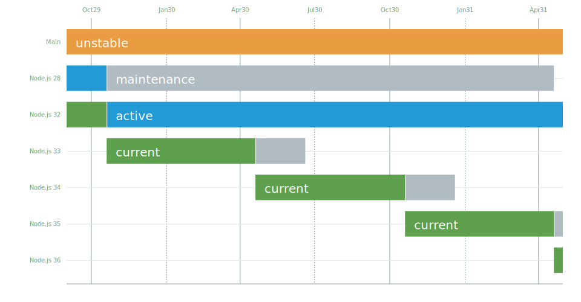

## Proposal 4: No Active LTS anymore

1. current duration: 12 months
2. active duration: 0 months
3. maintenance duration: 24 months

Total life span (from start of beta until end of maintenance): 36 months

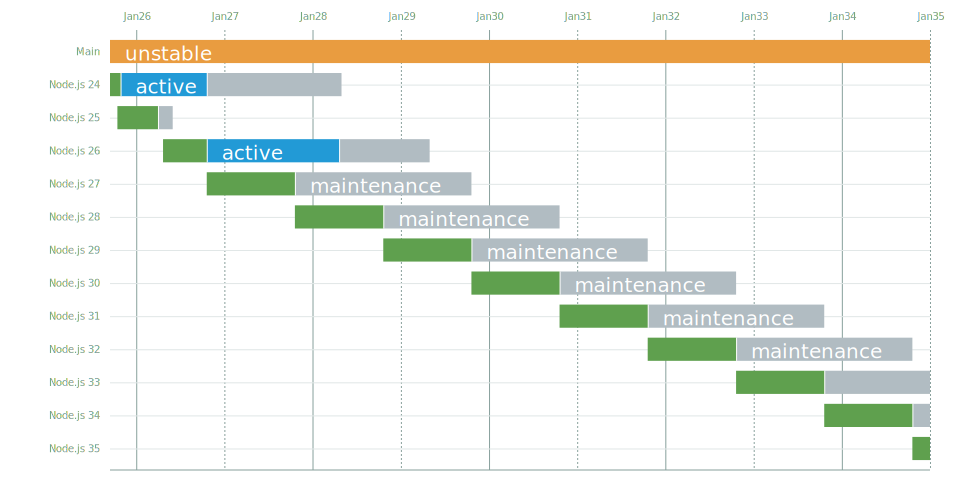

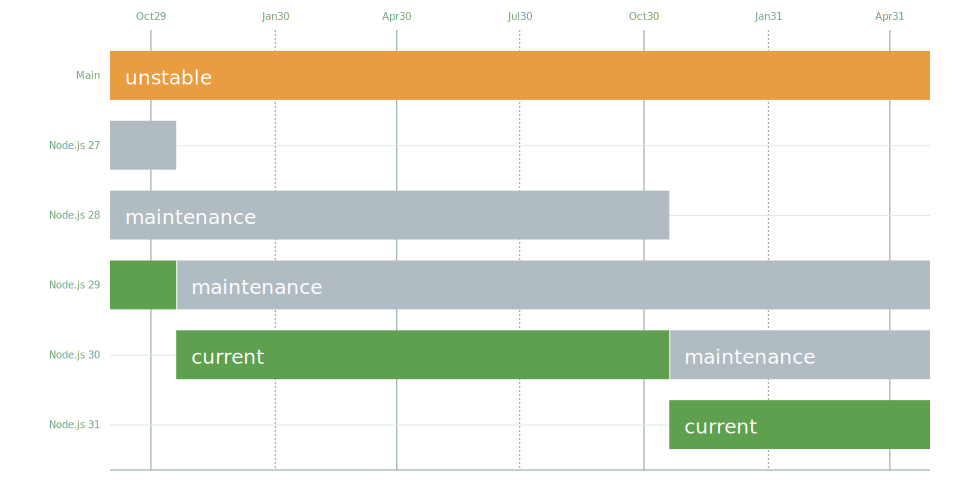

## Proposal 5: Rolling semver-major

1. current duration: 6 weeks
2. active duration:
 - 0 weeks
 - or 12 months for the October release
3. maintenance duration:
 - 8 weeks
 - or 18 months for the October release

Total life span (from start of beta until end of maintenance):
- 14 weeks
- or 31 months for the October release

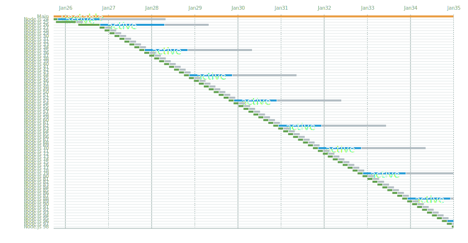

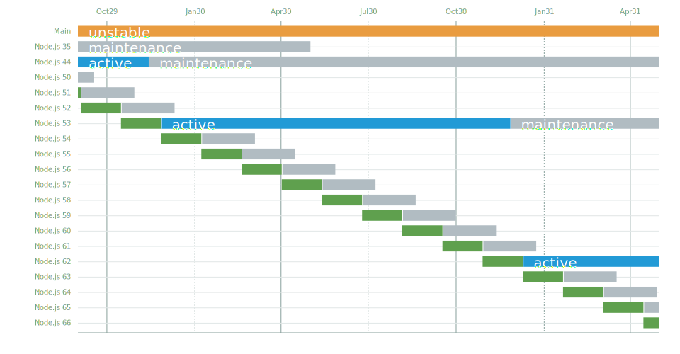
