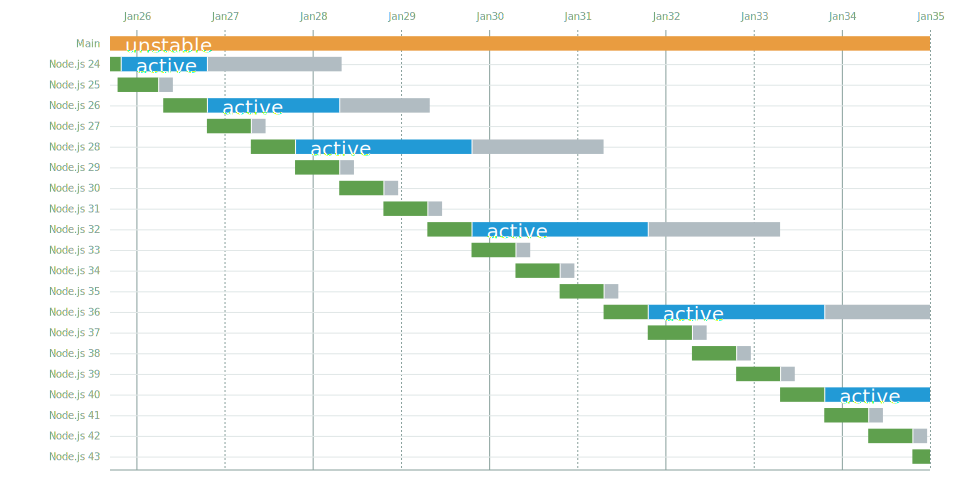

# Release schedule proposals

To add a new proposal to this list, update the `schedule` variable in `lib/index.js`, and use the following command:

```sh
node ./bin/lts.js -g release-schedule-proposal/<some-uniq-name>.svg >> release-schedule-proposal/README.md
```

Here are the release schedule proposals:

## Status quo

  1. current duration: 6 months
  2. active duration:
     - for even-numbered releases: 12 months
     - for odd-numbered releases: 0 months
  3. maintenance duration:
     - for even-numbered releases: 24 months
     - for odd-numbered releases: 3 months

  Total life span (from start of beta until end of maintenance):
  - for even-numbered releases: 42 months
  - for odd-numbered releases: 9 months

  

  

## LTS every year

  1. alpha duration: 5 months
  2. beta duration: 1 months
  3. current duration: 6 months
  4. active duration: 12 months
  5. maintenance duration: 18 months

  Total life span (from start of beta until end of maintenance): 37 months

  

  

## Longer life cycle

  1. current duration:
     - for even-numbered releases: 6 months
     - for odd-numbered releases: 12 months
  2. active duration:
     - for even-numbered releases: 18 months
     - for odd-numbered releases: 0 months
  3. maintenance duration:
     - for even-numbered releases: 24 months
     - for odd-numbered releases: 2 months

  Total life span (from start of beta until end of maintenance):
  - for even-numbered releases: 48 months
  - for odd-numbered releases: 14 months

  

  

## Less frequent LTS

  1. current duration: 6 months
  2. active duration:
     - for modulo-4-numbered releases: 24 months
     - for other releases: 0 months
  3. maintenance duration:
     - for modulo-4-numbered releases: 18 months
     - for other releases: 2 months

  Total life span (from start of beta until end of maintenance):
  - for module-4-numbered releases: 48 months
  - for releases: 8 months

  

  

## No Active LTS anymore

  1. current duration: 12 months
  2. active duration: 0 months
  3. maintenance duration: 24 months

  Total life span (from start of beta until end of maintenance): 36 months

  

  
